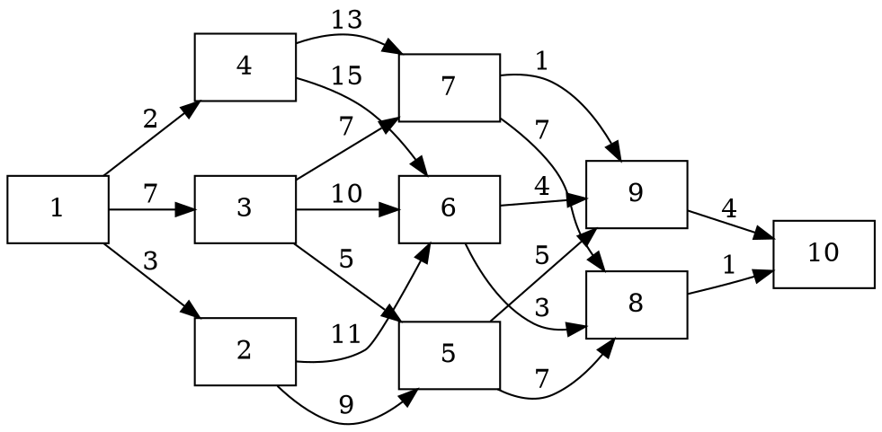
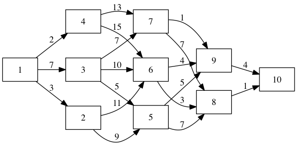
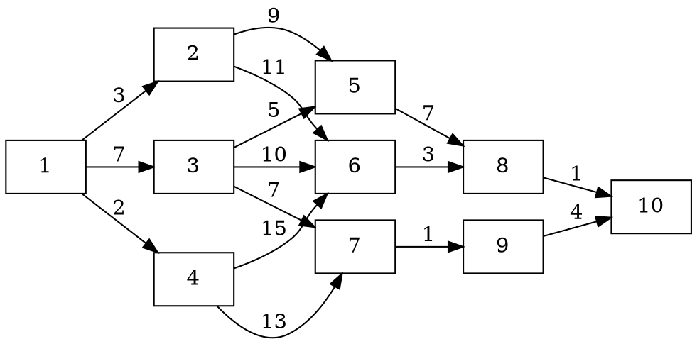
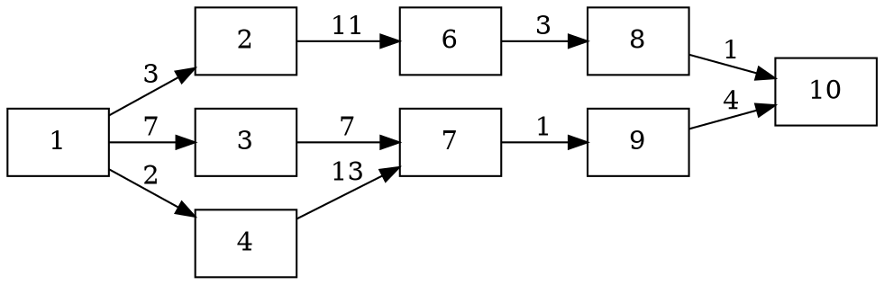
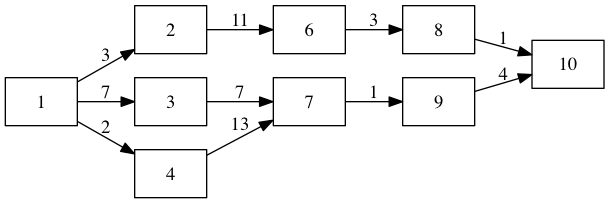
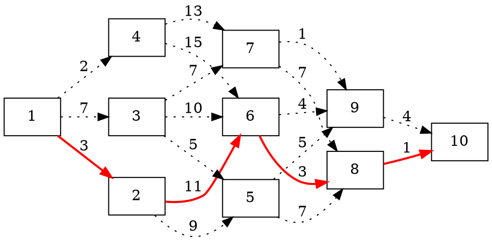
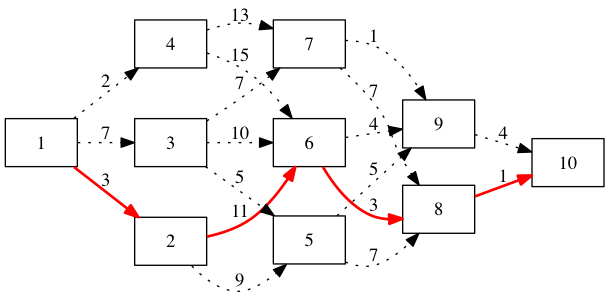
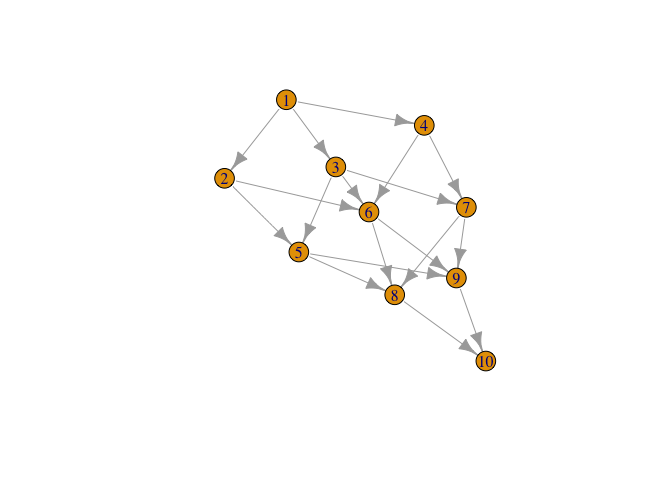

# Динамическое программирование
Тушавин В.А.  
24 ноября 2015 г.  
 
Динамическое программирование позволяет находить оптимальное решение задачи путем её декомпозиции на несколько этапов.
 
Такой подход приводит одну большую по размерности задачу ко многих задачам, имеющим меньшую размреность. Это значительно сокращает объем вычислений и ускоряет процесс принятия управленческих решений. Вычисления производятся реккурентно в том смысле, что оптимальное решение одной подзадачи используется в качестве исходных данных для следующей.
 
 
**Задача.** Определить оптимальный маршрут из пункта 1 в пункт 10 по схеме маршрута движения
 

 




 
 
 
Каждый квадрат на схеме изображает один из населенных пунктов, которые для удобства пронумерованы. Стоимость проезда из пункта i в пункт j обозначим через с~ij~ (обозначено на стрелках). Требуется определить такой путь из пункта 1 в пункт 10, общая стоимость которого является минимальной.
 
### Решение без применения компьютера
 
*Решение:* Воспользуемся формулой *реккурентных соотношений Беллмана*
 
$$f_n(i)=\min_j\{c_{ij}+f_{n-1}(j)\},\ n=\bar{1,N},$$
 
где *N* --- количество этапов в решении; $f_n(i)$ --- стоимость, отвечающая стратегии минимальных затрат для пути от пункта *i*, если до конечного пункта остается *n* шагов; $P_n(i)$ --- решение, позволяющее достичь  $f_n(i)$.
 
Начинаем поиск от конечного пункта.
 
**n=1**
 
$f_1(8)=c_{8,10}=1, P_1(8)=10;$
 
$f_1(9)=c_{9,10}=4, P_1(9)=10;$
 
**n=2**
 
$f_2(5)=\min\{c_{5,8}+f_1(8);c_{5,9}+f_1(9)\}=8, P_2(5)=8;$
 
$f_2(6)=\min\{c_{6,8}+f_1(8);c_{6,9}+f_1(9)\}=4, P_2(6)=8;$
 
$f_2(7)=\min\{c_{7,8}+f_1(8);c_{7,9}+f_1(9)\}=5, P_2(7)=9;$
 




 
 
 
 
**n=3**
 
$f_3(2)=\min\{c_{2,5}+f_2(5);c_{2,6}+f_2(6)\}=15, P_3(2)=6;$
 
$f_3(3)=\min\{c_{3,5}+f_2(5);c_{3,6}+f_2(6);c_{3,7}+f_2(7)\}=12, P_3(3)=7;$
 
$f_3(4)=\min\{c_{4,6}+f_2(6);c_{2,7}+f_2(7)\}=18, P_3(4)=7;$
 
 




 
 
**n=4**
 
$f_4(1)=\min\{c_{1,2}+f_3(2);c_{1,3}+f_3(3);c_{1,4}+f_3(4)\}=18, P_4(1)=3;$
 
Таким образом оптимальный путь 1-2-6-8-10, затраты по которому составляют $f_4(1)=18$
 
 




 
 
 

 
### Решение в R
 
Для решения задач связанных с поиском кратчайшего пути в графе в GNU R можно использовать функцию пакет **igraph**. В таком случае
 

```r
library(igraph)
```

```
## 
## Attaching package: 'igraph'
## 
## Следующие объекты скрыты от 'package:stats':
## 
##     decompose, spectrum
## 
## Следующий объект скрыт от 'package:base':
## 
##     union
```
 
Опишем граф как таблицу.
 

```r
mytable<-data.frame(from=c(1,1,1,2,2,3,3,3,4,4,5,5,6,6,7,7,8,9),
                    to=c(2,3,4,5,6,5,6,7,6,7,8,9,8,9,8,9,10,10),
                    weight=c(3,7,2,9,11,5,10,7,15,13,7,5,3,4,7,1,1,4))
head(mytable)
```

```
##   from to weight
## 1    1  2      3
## 2    1  3      7
## 3    1  4      2
## 4    2  5      9
## 5    2  6     11
## 6    3  5      5
```
 
Задаем граф, рисуем его и находим кратчайшие пути. В данном случае, поскольку все веса неотрицательны, по умолчанию будет использоваться [алгоритм Дейкстры](https://ru.wikipedia.org/wiki/%D0%90%D0%BB%D0%B3%D0%BE%D1%80%D0%B8%D1%82%D0%BC_%D0%94%D0%B5%D0%B9%D0%BA%D1%81%D1%82%D1%80%D1%8B). Поскольку мы говорим о динамическом программировании, то надо явно указывать [алгоритм Беллмана–Форда](https://ru.wikipedia.org/wiki/%D0%90%D0%BB%D0%B3%D0%BE%D1%80%D0%B8%D1%82%D0%BC_%D0%91%D0%B5%D0%BB%D0%BB%D0%BC%D0%B0%D0%BD%D0%B0_%E2%80%94_%D0%A4%D0%BE%D1%80%D0%B4%D0%B0).
 

```r
g<-graph.data.frame(mytable,directed =T )
plot(g)
```

 

```r
distances(g,algorithm ="bellman-ford")
```

```
##     1  2  3  4  5  6  7  8  9 10
## 1   0  3  7  2 12 14 14 17 15 18
## 2   3  0 10  5  9 11 15 14 14 15
## 3   7 10  0  9  5 10  7 12  8 12
## 4   2  5  9  0 14 15 13 18 14 18
## 5  12  9  5 14  0  9  6  7  5  8
## 6  14 11 10 15  9  0  5  3  4  4
## 7  14 15  7 13  6  5  0  6  1  5
## 8  17 14 12 18  7  3  6  0  5  1
## 9  15 14  8 14  5  4  1  5  0  4
## 10 18 15 12 18  8  4  5  1  4  0
```

```r
shortest_paths(g, 1, 10)$vpath
```

```
## [[1]]
## + 5/10 vertices, named:
## [1] 1  2  6  8  10
```

#### Информация о параметрах R


```r
sessionInfo()
```

```
## R version 3.2.2 (2015-08-14)
## Platform: x86_64-apple-darwin13.4.0 (64-bit)
## Running under: OS X 10.9.5 (Mavericks)
## 
## locale:
## [1] ru_RU.UTF-8/ru_RU.UTF-8/ru_RU.UTF-8/C/ru_RU.UTF-8/ru_RU.UTF-8
## 
## attached base packages:
## [1] stats     graphics  grDevices utils     datasets  methods   base     
## 
## other attached packages:
## [1] igraph_1.0.1
## 
## loaded via a namespace (and not attached):
##  [1] magrittr_1.5    formatR_1.2.1   tools_3.2.2     htmltools_0.2.6
##  [5] yaml_2.1.13     stringi_1.0-1   rmarkdown_0.8.1 knitr_1.11     
##  [9] stringr_1.0.0   digest_0.6.8    evaluate_0.8
```
