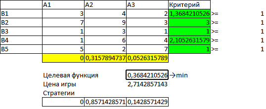
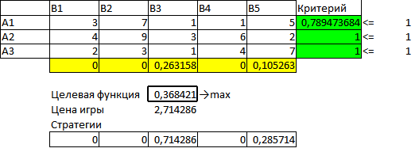

### Постановка задачи

Удобным способом задания игры двух участников с нулевой суммой является платежная матрица. Отсюда, кстати, происходит еще одно их название — матричные игры. Каждый элемент платежной матрицы a~ij~ содержит числовое значение выигрыша игрока I (проигрыша игрока II), если первый применяет стратегию i, а второй —- стратегию j.

Термины выигрыш и проигрыш следует понимать в широком смысле, т. к. они могут принимать отрицательные значения и с житейской точки зрения означать противоположное. Нетривиальность задачи прежде всего заключается в том, что каждый из игроков делает свой выбор, не зная о выборе другого, что существенно осложняет процесс оптимизации выбираемой стратегии.

Пусть в игре участвуют первый и второй игрок, каждый из них может
записать цифры 1,2,3. Если разница между цифрами положительна,
то выигрывает первый игрок, если отрицательна, то второй.
Число выигранных очков равно разности между цифрами.

```{r}
(mtx<-matrix(c(0,1,2,-1,0,1,-2,1,0),ncol=3))

```

#### Стратегия первого игрока


Наилучшая стратегия первого игрока.
Если игрок выбирает стратегию 1, то в худшем случае он получает выигрыш

```{r}
min(mtx[1,])

```

Если стратегию 2

```{r}
min(mtx[2,])

```

Если стратегию 3

```{r}
min(mtx[3,])
```

Максимизируем свой минимальный выигрыш

```{r}
max(min(mtx[1,]),min(mtx[2,]),min(mtx[3,]))
```

Это величина $\alpha$ -- гарантированный выигрыш игрока A или нижняя цена игры. Сама стратегия называется максиминной.


#### Стратегия второго игрока

Второй игрок в худшем случае при стратегии 1 получит проигрыш

```{r}
max(mtx[,1])

```
При второй стратегии

```{r}
max(mtx[,2])

```

При третьей стратегии

```{r}
max(mtx[,3])

```
Минимизируем свой максимальный проигрыш/

```{r}
min(max(mtx[,1]),max(mtx[,2]),max(mtx[,3]))
```

Это величина $\beta$ -- гарантированный проигрыш игрока B или верхняя цена игры. Сама стратегия называется минимаксной.

#### Седловая точка


Для матричных игр справедливо неравенство $\alpha \le \beta$

Если $\alpha=\beta=\gamma$, то такая игра называется игрой с седловой точкой. Если платежная матрица не имеет седловой точки, то поиск решения приводит к сложной стратегии, состояшей в случайном применении двух и более стратегий с определенными частотами. такая сложная стратегия называется смешанной.

#### Упрощение матрицы

```{r echo=F}
(mtx<-matrix(c(8,5,4,5,1,
               6,3,7,3,4,
               4,2,7,2,4,
               4,2,3,2,2,
               3,1,5,1,3),ncol=5))

```
Решение
```{r}
(a<-apply(mtx,1,min))
max(a)
```

```{r}
(b<-apply(mtx,2,max))
min(b)
```
$3 \le \nu \le 4$


```{r}
mtx

```
Для первого игрока стратегии 2 и 4 одинаковы, Все эелементы стратегии 2 меньше стратегии 1, значит тоже можно исключить. Все элементы 5 стратегии меньше 3. Исключаем пятую стратегию.


```{r}
mtx[c(1,3),]

```

Для второго игрока сравниваем 1 и 4, исключаем 1. Сравниваем 2 и 5, исключаем 2.

```{r}
(mtx1<-mtx[c(1,3),c(3,4,5)])
max(apply(mtx1,1,min))
min(apply(mtx1,2,max))
```
### Решение матричных игр сведением к линейному программированию

Рассмотрим игру двух лиц с нулевой суммой заданную платежами

$$A = {\left\| {{a_{ij}}} \right\|_{m \times n}}$$

Применение первым игроком оптимальной стратегии должно обеспечить ему при любых действиях второго игрока выигрыш не менее цены игры

$$\sum\limits_{i = 1}^m {{a_{ij}}{x_{i\;\text{опт}}} \ge \nu ,\;j = \overline {1,n} } $$

Рассмотрим задачу отыскания оптимальной стратегии игрока при огрнаничениях 

$$\left\{ {\begin{array}
{{a_{11}}{x_1} + {a_{21}}{x_2} +  \ldots  + {a_{m1}}{x_m} \ge \nu }\\
{{a_{12}}{x_1} + {a_{22}}{x_2} +  \ldots  + {a_{m2}}{x_m} \ge \nu }\\
 \cdots \\
{{a_{1n}}{x_1} + {a_{2n}}{x_2} +  \ldots  + {a_{mn}}{x_m} \ge \nu }
\end{array}} \right.$$

Величина $\nu$ неизвестна, однако можно считать что цена игры $\nu>0$. Последнее условие выполняется всегда, если все элементы платежной матрицы неотрицательны, а это можно достигнуть прибавив ко всем элементам некую константу. Преобразуем ограничения поделив неравентва на $\nu$.

$$\left\{ {\begin{array}
{{a_{11}}{t_1} + {a_{21}}{t_2} +  \ldots  + {a_{m1}}{t_m} \ge 1}\\
{{a_{12}}{t_1} + {a_{22}}{t_2} +  \ldots  + {a_{m2}}{t_m} \ge 1}\\
 \cdots \\
{{a_{1n}}{t_1} + {a_{2n}}{t_2} +  \ldots  + {a_{mn}}{t_m} \ge 1}
\end{array}} \right.$$

где

$${t_i} = \frac{{{x_i}}}{\nu } \ge 0$$

По условию $x_1+x_2+\ldots +x_m=1$ (сумма вероятностей). Разделим обе части этого неравенства на $\nu$.

$$t_1+t_2+\ldots +t_m=\frac{1}{\nu}$$

Оптимальная стратегия игрока A должна максимизировать величину $\nu$, следовательно, функция:

$$L(\bar t) = \sum\limits_1^m {{t_i} \to \min } $$

Для второго игрока проигрыш не должен превышать цену игры. В результате имеем симметричную пару двойственных задач.

#### Пример решения в R

Дана матрица игры

```{r echo=F}
(mtx<-matrix(c(3,4,2,
               7,9,3,
               1,3,1,
               1,6,4,
               5,2,7),ncol=5))
```
```{r}
(a<-max(apply(mtx,1,min)))
(b<-min(apply(mtx,2,max)))
```
Игра не имеет седловой точки. Оптимальное решение следует искать в области смешанных стратегий.

```{r}
library(lpSolve)
(result<-lp("min",c(1,1,1), t(mtx), rep(">=",5),c(1,1,1,1,1)))
result$objval
result$solution
(a<-result$solution/result$objval)
(result<-lp("max",c(1,1,1,1,1), mtx, rep("<=",3),c(1,1,1)))
result$objval
result$solution
(b<-result$solution/result$objval)
```
Таким образом цена игры равна `r 1/result$objval`, оптимальная стратегия A равна (`r a`), оптимальная стратегия B равна  (`r b`).

#### Построение имитационной модели
```{r}
# Функция, возвращающая индекс стратегии
get.k<-function(vec){
  cusum=0
  tst=runif(1)
  for(i in 1:length(vec)) {
   if(vec[i]==0) next
   cusum<-cusum+vec[i]
   if(tst>cusum) next
  return(i)
  }
}
set.seed(2015)
test<-c()
for(i in 1:1000) test=c(test,mtx[get.k(a),get.k(b)])

table(test)
summary(test)
```
Пусть A выбирает стратегию случайно

```{r}
test<-c()
for(i in 1:1000) test=c(test,mtx[sample(1:3, 1),get.k(b)])

table(test)
summary(test)
```
Как видим, результат хуже. Аналогично рассмотрим вариант для B.

```{r}
test<-c()
for(i in 1:1000) test=c(test,mtx[get.k(a),sample(1:5, 1)])

table(test)
summary(test)
```

В этом случае, B проигрывает больше.

### Решение в LibreOffice

Пример решения приведен в файле [matrix.ods](Samples/LibreOffice/matrix.ods).

Решение сводится к решениям прямой и обратной задач линейного программирования с помощью встроенной системы Решатель.






Результаты получаются аналогичными вышеприведенному решению.

#### Информация о параметрах R

```{r}
sessionInfo()

```