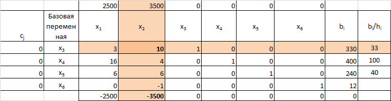
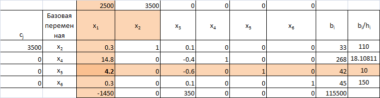
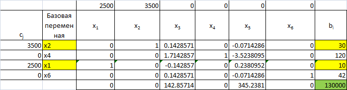
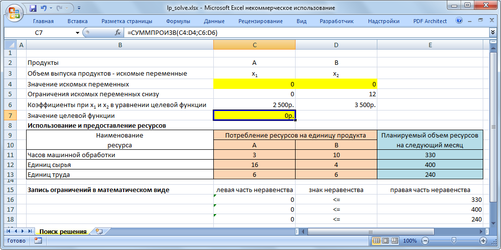

### Постановка задачи


Николай Кузнецов управляет небольшим механическим заводом. В будущем месяце он планирует изготавливать два продукта (А и В), по которым удельная маржинальная прибыль оценивается в 2500 и 3500 руб., соответственно.

Изготовление обоих продуктов требует затрат на машинную обработку, сырье и труд На изготовление каждой единицы продукта А отводится 3 часа машинной обработки, 16 единиц сырья и 6 единиц труда. Соответствующие требования к единице продукта В составляют 10, 4 и 6. Николай прогнозирует, что в следующем месяце он может предоставить 330 часов машинной обработки, 400 единиц сырья и 240 единиц труда. Технология производственного процесса такова, что не менее 12 единиц продукта В необходимо изготавливать в каждый конкретный месяц.

Наименование ресурса | A  | B  | Объем ресурсов
---------------------|----|----|---------------
Часы маш.обработки   |  3 | 10 |  330
Единиц сырья         | 16 |  4 |  400
Единиц труда         |  6 |  6 |  240


Николай хочет построить модель с тем, чтобы определить количество единиц продуктов А и В, которые он доложен производить в следующем месяце для максимизации маржинальной прибыли.

### Решение задачи
#### Этап 1. Определение переменных

Существует целевая переменная (обозначим её Z), которую необходимо оптимизировать, то есть максимизировать или минимизировать (например, прибыль, выручка или расходы). Николай стремится максимизировать маржинальную прибыль, следовательно, целевая переменная:

Z --- это суммарная маржинальная прибыль (в рублях), полученная в следующем месяце в результате производства продуктов А и В.

Существует ряд неизвестных искомых переменных (обозначим их х~1~, х~2~, х~3~ и пр.), чьи значения необходимо определить для получения оптимальной величины целевой функции, которая, в нашем случае является суммарной маржинальной прибылью. Эта маржинальная прибыль зависит от количества произведенных продуктов А и В. Значения этих величин необходимо рассчитать, и поэтому они представляют собой искомые переменные в модели. Итак, обозначим:

х~1~ --- количество единиц продукта А, произведенных в следующем месяце.

х~2~ --- количество единиц продукта В, произведенных в следующем месяце.

Очень важно четко определить все переменные величины; особое внимание уделите единицам измерения и периоду времени, к которому относятся переменные.

### Этап. 2. Построение целевой функции

Целевая функция --- это линейное уравнение, которое должно быть или максимизировано или минимизировано. Оно содержит целевую переменную, выраженную с помощью искомых переменных, то есть Z выраженную через х~1~, х~2~, ... в виде линейного уравнения.

В нашем примере каждый изготовленный продукт А приносит 2500 руб. маржинальной прибыли, а при изготовлении х~1~ единиц продукта А, маржинальная прибыль составит 2500х~1~. Аналогично маржинальная прибыль от изготовления х~2~ единиц продукта В составит 3500х~2~. Таким образом, суммарная маржинальная прибыль, полученная в следующем месяце за счет производства х~1~ единиц продукта А и х~2~ единиц продукта В, то есть, целевая переменная Z составит: Z = 2500х~1~+3500х~2~.

Николай стремится максимизировать этот показатель. Таким образом, целевая функция в нашей модели:

$$Z = 2500 х_1 + 3500 х_2 \to \max $$

### Этап. 3. Определение ограничений

Ограничения – это система линейных уравнений и/или неравенств, которые ограничивают величины искомых переменных. Они математически отражают доступность ресурсов, технологические факторы, условия маркетинга и иные требования. Ограничения могут быть трех видов: «меньше или равно», «больше или равно», «строго равно».

В нашем примере для производства продуктов А и В необходимо время машинной обработки, сырье и труд, и доступность этих ресурсов ограничена. Объемы производства этих двух продуктов (то есть значения х~1~ и х~2~) будут, таким образом, ограничены тем, что количество ресурсов, необходимых в производственном процессе, не может превышать имеющееся в наличии. Рассмотрим ситуацию со временем машинной обработки. Изготовление каждой единицы продукта А требует трех часов машинной обработки, и если изготовлено х~1~, единиц, то будет потрачено Зх~1~, часов этого ресурса.

Изготовление каждой единицы продукта В требует 10 часов и, следовательно, если произведено х~2~ продуктов, то потребуется 10х~2~ часов. Таким образом, общий объем машинного времени, необходимого для производства х~1~ единиц продукта А и х~2~ единиц продукта В, составляет 3х~1~+10х~2~. Это общее значение машинного времени не может превышать 330 часов. Математически это записывается следующим образом:

3х~1~+10х~2~≤330

Аналогичные соображения применяются к сырью и труду, что позволяет записать еще два ограничения:

16х~1~+4х~2~≤400

6х~1~+6х~2~≤240

Наконец следует отметить, что существует условие, согласно которому должно быть изготовлено не менее 12 единиц продукта В:

х~2~≥12

#### Этап. 4. Запись условий неотрицательности

Искомые переменные не могут быть отрицательными числами, что необходимо записать в виде неравенств х~1~≥0 и х~2~≥0. В нашем примере второе условия является избыточным, так как выше было определено, что х~2~ не может быть меньше 12.

Полная модель линейного программирования для производственной задачи Николая может быть записана в виде:

$$Z = 2500 х_1 + 3500 х_2 \to \max $$

$$\left\{ {\begin{array}
{3{x_1} + 10{x_2} \le 330}\\
{16{x_1} + 4{x_2} \le 400}\\
{6{x_1} + 6{x_2} \le 240}\\
{{x_1} \ge 0}\\
{{x_2} \ge 12}
\end{array}} \right.$$

### Решение симплекс-методом

Симплексный метод является универсальным методом решения задачи линейного грограммирования, так как позволяет решить практически любую задачу, представленную в каноническом виде.

Идея симплексного метода заключатся в том, что, начиная с некоторого опорного решения, осуществляется последовательно направленное перемещение по опорным решениям системы к оптимальному опорному решению. Так как число опорных решений конечно, то через конечное число шагов оптимальное решение будет найдено.

Алгорим симплексного метода можно описать следующим образом:

1. Привести задачу к каноническому виду
2. Найти неотрицательное базисное решение системы ограничений
3. Рссчитать оценки свободных переменных по формуле:

$${\Delta}_j = \sum\limits_{i = 1}^r {{c_i}{h_{ij}} - {c_j}} ,\;j = \overline {1,n} ,$$

где h~ij~ -- коэффициенты при свободной переменной x~j~,

c~i~ -- коэффициенты при базисных переменных в целевой функции,

c~j~ -- коэффициенты при свободной переменной в целевой функции,

4. Проверить найденное опорное решение на оптмальность:

а) если все оценки ${\Delta}_j \ge 0$, то найденное решение оптимально и задача решена;

б) если хотя бы одна оценка ${\Delta}_j < 0$, а при соответствующей переменной x~j~ нет ни одного положительного коэффициента, то задача не имеет оптимального решения из-за ограниченности целевой функции

в) если хотя бы одна оценка ${\Delta}_j < 0$, а при соответствующей переменной x~j~ есть хотя бы один положительный коэффициент, то решение не оптимально и его можно улучшить переходом к новому базису. Если отрицательных оценок несколько,то в базис ввести переменную с наибольшей по абсолютной величине отрицательной оценкой.

Приведем задачу к **каноническому виду**.

Полная модель линейного программирования для производственной задачи Николая может быть записана в виде:

$$Z = 2500 х_1 + 3500 х_2 \to \max $$

$$\left\{ {\begin{array}
{3{x_1} + 10{x_2} + {x_3} = 330}\\
{16{x_1} + 4{x_2} + {x_4} = 400}\\
{6{x_1} + 6{x_2} + {x_5} = 240}\\
{-{x_2} +{x_6} = 12}\\
{{x_j} \ge 0\;j = \overline {1,n}}
\end{array}} \right.$$

Б.п. |    x~1~ |    x~2~ |    x~3~ |    x~4~ |    x~5~ |    x~6~ |  b~i~
-----|-------|-------|-------|-------|-------|-------|-----
**x~3~**   |     3 |    10 |     1 |     0 |     0 |     0 | 330
**x~4~**   |    16 |     4 |     0 |     1 |     0 |     0 | 400
**x~5~**   |     6 |     6 |     0 |     0 |     1 |     0 | 240
**x~6~**   |     0 |    -1 |     0 |     0 |     0 |     1 |  12

$$\bar{x}_{\text{опор}}=(0;0;330;400;20;12)$$

Проверим данное решение на оптимальность, для этого найдем свободные переменные в симплексной таблице. Вычисления представлены в файле [lp_simplex.xlsx](lp_simplex.xlsx).



Данное решение не оптимально, поскольку в нижней строчке есть отрицательные значения. Поскольку имеются положительные коэффициенты, решение можно улучшить, для этого введем в базис переменную x~2~. Так как в колонке x~2~ имеется несколько положительных коэффициентов, то определяем отношение свободного члена b~i~ к соответсвующим коэффициентам в данной колонке и выбираем наименьший результат.

Преобразуем таблицу и повторим расчет.



Данное решение не оптимально, поскольку в нижней строчке есть отрицательные значения. Поскольку имеются положительные коэффициенты, решение можно улучшить, для этого введем в базис переменную x~1~.



Полученное решение ( 10; 30) является оптимальным. 

### Решение с помощью Excel и LibreOffice 

Решение в Excel осуществляется с помощью надстройки "Поиск решения", также использующей симплекс-метод.



Файл с решением [lp_solve.xlsx](lp_solve.xlsx)

Анологично даную задач можно решить с помощью Решателя в LibreOffice. Следует отметить, что в LibreOffice нет ограничений на число переменных, в отличии от Excel.

### Решение в R

Для решения задач линеного программирования в GNU R можно использовать
следующие пакеты:

- lpSolve
- linprog

Второй пакет является надстройкой над первым и позволяет выводить больше диагностической
информации


#### Решение с пакетом lpSolve


```{r}
library(lpSolve) # Подключили библиотеку
f.obj <- c(2500, 3500) # Описали целевую функцию
names(f.obj) <-c("A","B")
a.mat<-rbind(c(3,10), # матрица
             c(16,4),   # коээфициентов
             c(6,6),    # при ограничениях
             c(1,0),
             c(0,1))   
a.dir<-c("<=","<=","<=",">=",">=")
b.vec<-c(330,400,240,0,12) # вектор ограничений

result<-lp ("max", f.obj, a.mat, a.dir, b.vec)
```

#### Результат


```{r}
result
result$solution
```

Таким образом, максимальное значение целевой функции равно 130000 и оно достигается при x~1~ и x~2~ равными, соответственно: 10 и 30.

#### Решение с пакетом linprog

Поскольку пакет *linprog* является дополнением к предыдущему пакету, то переменные уже все инициализированы.


```{r}
library(linprog)
(result<-solveLP( f.obj, b.vec, a.mat, TRUE,const.dir=a.dir,lpSolve=T))
```

Результат получился тот же, дополнительно выведена информация по свободным ресурсам. 
Таким образом,GNU R предоставляет достаточно удобный механизм для решения задач линейного программирования.

#### Графическое представление решения

```{r lp,fig.width=7,fig.height=7}
x1<- (-100:500)/10
old<-par(mar=c(1,1,1,1))
plot(0,type="n",xlab="",ylab="", xlim=c(-10, 50),ylim = c(-10, 50),bty="n",xaxt="n",yaxt="n")
polygon(c(0,0,10,20,22),c(12,33,30,20,12), col = "lightblue", border = NA)
axis(1,pos=c(0,0),at=c(-10,10,20,30,40))
axis(2,pos=c(0,0),las=2,at=c(-10,10,20,30,40))
arrows(-10.5,0,51,0,angle=15)
arrows(0,-10.5,0,51,angle=15)
lines(x1,(330-3*x1)/10,col="blue")
text(30,30,expression(3*х[1]+10*х[2]==330),cex=0.8,col="blue")
lines(x1,(400-16*x1)/4,col="red")
text(20,45,expression(16*х[1]+4*х[2]==400),cex=0.8,col="red")
lines(x1,(240-6*x1)/6,col="green")
text(8,40,expression(6*х[1]+6*х[2]==240),cex=0.8,col="green")
abline(h=12)
lines(x1,(-25*x1)/35,lty=3,lwd=3)
text(-5,5,expression(2500*х[1]+3500*х[2]==0),cex=0.8)
arrows(0,0,12.5,17.5)
lines(x1,(130000-2500*x1)/3500,lty=2,lwd=3)
text(35,20,expression(2500*х[1]+3500*х[2]==130000),cex=0.8)
points(10,30,cex=1.5,col="red",pch=19)

```


#### Информация о параметрах R

```{r}
sessionInfo()

```

