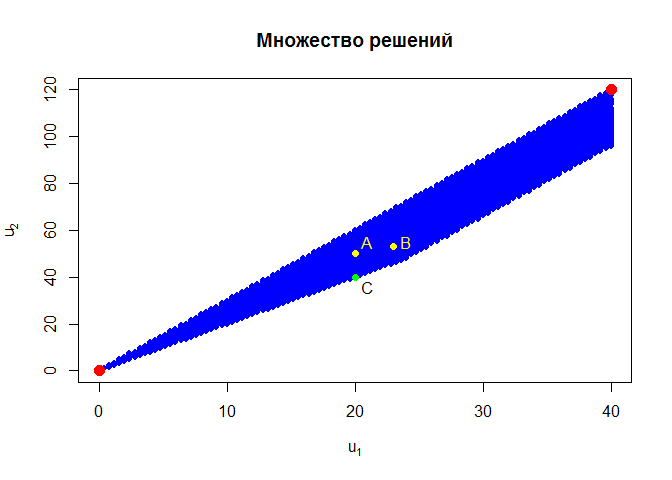

# Многокритериальная оптимизация
Тушавин В. А.  
8 декабря 2015 г.  

Рассмотрим задачу. Рекламное агентство, в штате которого десять человек получило заказ на рекламу нового продукта на радио и телевидении. Данные о рекламной аудитории, стоимости ркуламы и количестве занятых при её изготовлении агентов заданы в таблице.

Характеристики        |     Радио    |  Телевидение
----------------------|--------------|---------------
Рекламная аудитория (млн. чел)     |       4      |       8
Стоимость минуты  рекламы ( в тыс. у.е.)    |       8      |      24   
Количесво занятых агентов |  1  | 2

Сколько минут рекламного времени должно купить агентство на радио и ТВ, чтобы максимизировать аудитоию и минимизировать издержки, если контракт запрещает более 6 минут на радио?

Имеем следующую задачу:

\[\left\{ {\begin{array}
{{u_1} = 4{x_1} + 8{x_2} \to \max }\\
{{u_2} = 8{x_1} + 24{x_2} \to \min }\\
{{x_1} \le 6}\\
{{x_1} + 2{x_2} \le 10}\\
{{x_1} \ge 0;\;{x_2} \ge 0}
\end{array}} \right.\]

Если решать задачу только на максимум имеем


```r
library(lpSolve) 
f.obj <- c(4, 8) # Описали целевую функцию
names(f.obj) <-c("X1","X2")
a.mat<-rbind(c(1,0), # матрица
             c(1,2),   # коээфициентов
             c(1,0),    # при ограничениях
             c(0,1))   
a.dir<-c("<=","<=",">=",">=")
b.vec<-c(6,10,0,0) # вектор ограничений
(result<-lp ("max", f.obj, a.mat, a.dir, b.vec))
```

```
## Success: the objective function is 40
```

```r
result$solution
```

```
## [1] 0 5
```

Если решать задачу только на минимум


```r
library(lpSolve) 
f.obj <- c(4, 24) # Описали целевую функцию
names(f.obj) <-c("X1","X2")
a.mat<-rbind(c(1,0), # матрица
             c(1,2),   # коээфициентов
             c(1,0),    # при ограничениях
             c(0,1))   
a.dir<-c("<=","<=",">=",">=")
b.vec<-c(6,10,0,0) # вектор ограничений
(result<-lp ("min", f.obj, a.mat, a.dir, b.vec))
```

```
## Success: the objective function is 0
```

```r
result$solution
```

```
## [1] 0 0
```

Графически задача выглядит следующим образом


```r
x1<- (-10:100)/10
old<-par(mar=c(1,1,1,1))
plot(0,type="n",xlab="",ylab="", xlim=c(-1, 10),ylim = c(-1, 10),bty="n",xaxt="n",yaxt="n")
grid()
polygon(c(0,0,6,6),c(0,5,2,0), col = "lightblue", border = NA)
axis(1,pos=c(0,0),at=c(-1,1,2,3,4,5,6,7,8,9))
axis(2,pos=c(0,0),las=2,at=c(-1,1,2,3,4,5,6,7,8,9))
arrows(-1.2,0,10.1,0,angle=15)
arrows(0,-1.2,0,10.1,angle=15)
lines(x1,(10-x1)/2,col="blue")
text(4,4,expression(х[1]+2*х[2]==10),cex=0.8,col="blue")
abline(v=6)
text(0.5,10,expression(х[2]))
text(10,-0.5,expression(х[1]))
points(0,0,cex=1.5,col="red",pch=19)
points(0,5,cex=1.5,col="red",pch=19)
```

 

```r
par(old)
```

Множество всех решений может быть представлено:


```r
x1<-seq(0,6,by=0.1)
x2<-seq(0,6,by=0.1)
d<-expand.grid(x1=x1,x2=x2)
d<-subset(d,x1+2*x2<=10)
d$u1<-4*d$x1+8*d$x2
d$u2<-8*d$x1+24*d$x2
plot(d$u2~d$u1,type="p",pch=19,col="blue",main="Множество решений",xlab=expression(u[1]),ylab=expression(u[2]),cex=0.8)
points(0,0,cex=1.5,col="red",pch=19)
points(40,120,cex=1.5,col="red",pch=19)
points(20,50,cex=1,col="yellow",pch=19)
text(21,55,"A",col="yellow")
points(23,53,cex=1,col="yellow",pch=19)
text(24,55,"B",col="yellow")

points(20,40,cex=1,col="green",pch=19)
text(21,36,"C")
```

 

Где u~1~ - аудитория в миллионах человек (эффективность), а u~2~ - стоимость рекламы. Рассмотрим решения А (20,50) и B(23,53). Вариант **A** имеет меньшую стоимость , но вариант **B** более эффективен. В таком случае можно говорить, что варианты несравнимы. Рассмотрим точку C(20,40). Как видим, при той же аудитории стоимость данного решения меньше. 

Найдем меножество всех таких точек и построим на графике.


```r
plot(d$u2~d$u1,type="p",pch=19,col="lightblue",main="Множество решений",xlab=expression(u[1]),ylab=expression(u[2]),cex=0.8)
z<-aggregate(u1~u2,data=d,max)
z<-aggregate(u2~u1,data=z,min)
lines(z$u2~z$u1,col="blue",lwd=2)
```

 

Данная линия называется Парето-оптимальными вариантами.

### Метод Салуквадзе

Метод Салуквадзе состоит из двух этапов. На первом этапе находим наилучшее значение по всем критериям.

```r
(u1<-max(d$u1))
```

```
## [1] 40
```

```r
(u2<-min(d$u2))
```

```
## [1] 0
```

```r
plot(d$u2~d$u1,type="p",pch=19,col="lightblue",main="Множество решений",xlab=expression(u[1]),ylab=expression(u[2]),cex=0.8)
points(u1,u2,pch=19,col="red")
```

 

Данная точка u^0^ не принадлежит области допустимых решений. На втором этапе найдем решение, как точку, ближайшую к данной:

$$R(u(x),{u^0}) \to \min ,\;x \in X$$

где R-- расстояние от u(X) до u^0^. В качестве R можно выбрать функцию:

$${\left( {\sum\limits_{i = 1}^M {{{(u_i^0 - {u_i}(x))}^l}} } \right)^{\frac{1}{l}}}$$


```r
d.new<-d
l<-2
d.new$s<-((u1-d.new$u1)^l+(u2-d.new$u2)^l)^(1/l)
head(d.new)
```

```
##    x1 x2  u1  u2        s
## 1 0.0  0 0.0 0.0 40.00000
## 2 0.1  0 0.4 0.8 39.60808
## 3 0.2  0 0.8 1.6 39.23264
## 4 0.3  0 1.2 2.4 38.87416
## 5 0.4  0 1.6 3.2 38.53310
## 6 0.5  0 2.0 4.0 38.20995
```

```r
tail(d.new)
```

```
##       x1  x2   u1    u2        s
## 2931 0.2 4.8 39.2 116.8 116.8027
## 2932 0.3 4.8 39.6 117.6 117.6007
## 2990 0.0 4.9 39.2 117.6 117.6027
## 2991 0.1 4.9 39.6 118.4 118.4007
## 2992 0.2 4.9 40.0 119.2 119.2000
## 3051 0.0 5.0 40.0 120.0 120.0000
```

```r
(u.opt<-d.new[which.min( d.new$s),])
```

```
##    x1 x2 u1 u2        s
## 21  2  0  8 16 35.77709
```

```r
plot(d$u2~d$u1,type="p",pch=19,col="lightblue",main="Множество решений",xlab=expression(u[1]),ylab=expression(u[2]),cex=0.8)
points(u1,u2,pch=19,col="red")
arrows(u1,u2,u.opt$u1,u.opt$u2)
text(u.opt$u1+2,u.opt$u2+5,paste0("U(",u.opt$u1,";",u.opt$u2,")"))
```

 

### Метод лексико-графического упорядочивания

На основании опроса ЛПР критерии ранжируются по важности. Предположим, что первым критерием мы выбираем охват аудитории. Тогда имеем множество возможных решений при максимальном критерии u~1~


```r
(z<-max(d$u1))
```

```
## [1] 40
```

```r
head(d.new<-subset(d,u1==z))
```

```
##       x1  x2 u1    u2
## 1281 6.0 2.0 40  96.0
## 1340 5.8 2.1 40  96.8
## 1399 5.6 2.2 40  97.6
## 1458 5.4 2.3 40  98.4
## 1517 5.2 2.4 40  99.2
## 1576 5.0 2.5 40 100.0
```

Находим наилучшее значение по второму критерию:


```r
(u.opt<-d.new[which.min( d.new$u2),])
```

```
##      x1 x2 u1 u2
## 1281  6  2 40 96
```

Представим графически:


```r
plot(d$u2~d$u1,type="p",pch=19,col="lightblue",main="Множество решений",xlab=expression(u[1]),ylab=expression(u[2]),cex=0.8)
lines(d.new$u1,d.new$u2,col="blue",lwd=2)
points(u.opt$u1,u.opt$u2,pch=19,col="red",cex=1.5)
text(u.opt$u1-3,u.opt$u2-5,paste0("U(",u.opt$u1,";",u.opt$u2,")"))
```

 

### Метод линейной свертки

ЛПР задает значение весов критериев и решается задача максимизации критерия.
Поскольку предполагается, что оба критерия должны быть максимизируемы, критерий u~2~ возьмем со знакоми минус. Пусть веса критериев равны 0.8 и 0.2, тогда:


```r
d.new<-d
d.new$s<-d.new$u1*0.8-d.new$u2*0.2
head(d.new)
```

```
##    x1 x2  u1  u2    s
## 1 0.0  0 0.0 0.0 0.00
## 2 0.1  0 0.4 0.8 0.16
## 3 0.2  0 0.8 1.6 0.32
## 4 0.3  0 1.2 2.4 0.48
## 5 0.4  0 1.6 3.2 0.64
## 6 0.5  0 2.0 4.0 0.80
```

```r
tail(d.new)
```

```
##       x1  x2   u1    u2    s
## 2931 0.2 4.8 39.2 116.8 8.00
## 2932 0.3 4.8 39.6 117.6 8.16
## 2990 0.0 4.9 39.2 117.6 7.84
## 2991 0.1 4.9 39.6 118.4 8.00
## 2992 0.2 4.9 40.0 119.2 8.16
## 3051 0.0 5.0 40.0 120.0 8.00
```

```r
subset(d.new,s==max(d.new$s))
```

```
##      x1 x2 u1 u2    s
## 1281  6  2 40 96 12.8
```

Пусть веса критериев равны
 

```r
d.new<-d
d.new$s<-d.new$u1*0.5-d.new$u2*0.5
head(d.new)
```

```
##    x1 x2  u1  u2    s
## 1 0.0  0 0.0 0.0  0.0
## 2 0.1  0 0.4 0.8 -0.2
## 3 0.2  0 0.8 1.6 -0.4
## 4 0.3  0 1.2 2.4 -0.6
## 5 0.4  0 1.6 3.2 -0.8
## 6 0.5  0 2.0 4.0 -1.0
```

```r
tail(d.new)
```

```
##       x1  x2   u1    u2     s
## 2931 0.2 4.8 39.2 116.8 -38.8
## 2932 0.3 4.8 39.6 117.6 -39.0
## 2990 0.0 4.9 39.2 117.6 -39.2
## 2991 0.1 4.9 39.6 118.4 -39.4
## 2992 0.2 4.9 40.0 119.2 -39.6
## 3051 0.0 5.0 40.0 120.0 -40.0
```

```r
subset(d.new,s==max(d.new$s))
```

```
##   x1 x2 u1 u2 s
## 1  0  0  0  0 0
```

Пр других весах имеем множество решений


```r
d.new<-d
d.new$s<-d.new$u1*0.75-d.new$u2*0.25
head(d.new)
```

```
##    x1 x2  u1  u2   s
## 1 0.0  0 0.0 0.0 0.0
## 2 0.1  0 0.4 0.8 0.1
## 3 0.2  0 0.8 1.6 0.2
## 4 0.3  0 1.2 2.4 0.3
## 5 0.4  0 1.6 3.2 0.4
## 6 0.5  0 2.0 4.0 0.5
```

```r
tail(d.new)
```

```
##       x1  x2   u1    u2   s
## 2931 0.2 4.8 39.2 116.8 0.2
## 2932 0.3 4.8 39.6 117.6 0.3
## 2990 0.0 4.9 39.2 117.6 0.0
## 2991 0.1 4.9 39.6 118.4 0.1
## 2992 0.2 4.9 40.0 119.2 0.2
## 3051 0.0 5.0 40.0 120.0 0.0
```

```r
subset(d.new,s==max(d.new$s))
```

```
##      x1  x2   u1   u2 s
## 183   6 0.2 25.6 52.8 6
## 488   6 0.7 29.6 64.8 6
## 915   6 1.4 35.2 81.6 6
## 1220  6 1.9 39.2 93.6 6
```

#### Информация о параметрах R


```r
sessionInfo()
```

```
## R version 3.2.2 (2015-08-14)
## Platform: x86_64-w64-mingw32/x64 (64-bit)
## Running under: Windows 7 x64 (build 7601) Service Pack 1
## 
## locale:
## [1] LC_COLLATE=Russian_Russia.1251  LC_CTYPE=Russian_Russia.1251   
## [3] LC_MONETARY=Russian_Russia.1251 LC_NUMERIC=C                   
## [5] LC_TIME=Russian_Russia.1251    
## 
## attached base packages:
## [1] stats     graphics  grDevices utils     datasets  methods   base     
## 
## other attached packages:
## [1] lpSolve_5.6.13
## 
## loaded via a namespace (and not attached):
##  [1] magrittr_1.5    formatR_1.2.1   tools_3.2.2     htmltools_0.2.6
##  [5] yaml_2.1.13     stringi_1.0-1   rmarkdown_0.8.1 knitr_1.11     
##  [9] stringr_1.0.0   digest_0.6.8    evaluate_0.8
```
